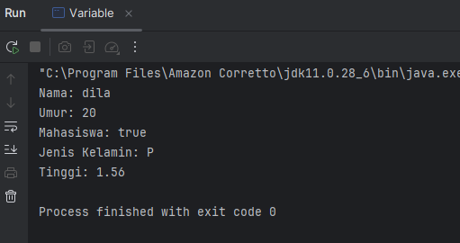
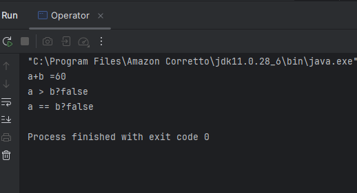
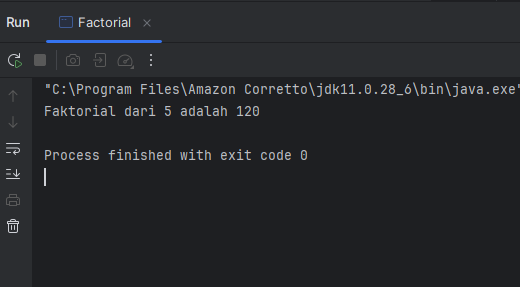
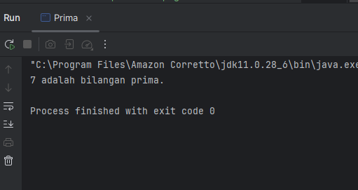
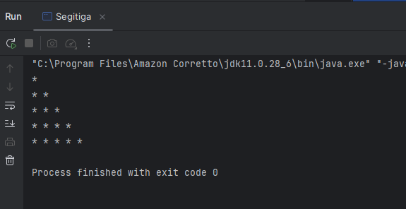

# Laporan Praktikum 1: Review Dasar Pemrograman Java
**Mata Kuliah:** Praktikum Design Pattern  
**Nama:** Nurul Fadila  
**NIM:** 2024573010026  
**Kelas:** TI 2A

---

## 1. Abstrak
Pemrograman Java merupakan salah satu bahasa pemrograman yang banyak digunakan dalam pengembangan perangkat lunak karena bersifat berorientasi objek, portabel, dan memiliki sintaks yang relatif mudah dipahami. Laporan ini bertujuan untuk melakukan review terhadap konsep dasar pemrograman Java melalui beberapa praktikum yang meliputi struktur dasar program, penggunaan variabel dan tipe data, operator dan ekspresi, percabangan, serta perulangan. Pemahaman terhadap konsep-konsep dasar ini sangat penting sebagai fondasi dalam mempelajari pemrograman yang lebih kompleks.

Metode yang digunakan dalam kegiatan ini adalah praktik langsung dengan membuat dan menganalisis beberapa program sederhana menggunakan bahasa Java. Contoh program yang digunakan antara lain program menampilkan teks (Hello World), penggunaan variabel dengan berbagai tipe data, operasi menggunakan operator, percabangan menggunakan if-else, serta perulangan menggunakan for. Selain itu juga dilakukan penyelesaian beberapa permasalahan seperti perhitungan faktorial, pengecekan bilangan prima, dan pembuatan pola segitiga menggunakan perulangan bersarang.

---
## 2. Praktikum
### Praktikum 1 - Pengenalan Java dan Lingkungan Pengembangan
#### Dasar Teori
Java adalah bahasa pemrograman berorientasi objek yang populer dan banyak digunakan untuk pengembangan aplikasi desktop, web, dan mobile. Java menggunakan sintaks yang mirip dengan C++ tetapi dirancang untuk lebih mudah dipahami dan digunakan.

Untuk memulai pemrograman Java, Anda perlu:

JDK (Java Development Kit): Berisi compiler dan tools untuk mengembangkan program Java.
IDE (Integrated Development Environment): Seperti IntelliJ IDEA, Eclipse, atau NetBeans untuk menulis dan menjalankan kode.

#### Langkah Praktikum
1. Pastikan JDK dan Intellij IDE Community Edition sudah terinstal. Jika belum, kunjungi url berikut untuk mengunduh JDK Amazon Correto dan Intellij
2. Buka IDE dan buat sebuah project baru dengan ketentuan seperti berikut:
   Name: ti_design_pattern
   Location: disesuaikan
   Build system: Intellij
   JDK: Amazon Correto
   Hilangkan centang pada bagian add sample code
3. Buat sebuah package baru di dalam folder src dengan cara klik kanan pada folder src kemudian pilih New -> Package. Beri nama modul_1.
4. Buat Sebuah class didalam package modul_1 dengan cara klik kanan dan pilih New -> Java Class. Beri nama HelloWorld
5. Isikan kode dibawah ini.
   
         public class HelloWorld {
          public static void main (String[] args) {
         System.out.println("Hello World");
         }
         }
6. Output:
    

   
#### Analisa dan Pembahasan
Analisa:

Program Java di atas merupakan program sederhana yang digunakan untuk menampilkan tulisan “Hello World” pada layar. Program ini biasanya digunakan sebagai contoh dasar untuk memahami struktur penulisan program pada bahasa pemrograman Java.

Pada baris public class HelloWorld, program mendeklarasikan sebuah class dengan nama HelloWorld. Kata kunci public menunjukkan bahwa class tersebut dapat diakses oleh class lain. Dalam bahasa Java, setiap program harus berada di dalam sebuah class, dan biasanya nama file program harus sama dengan nama class yang dibuat.

Selanjutnya pada bagian public static void main(String[] args) merupakan method utama (main method) yang menjadi titik awal ketika program dijalankan. Kata public menunjukkan bahwa method dapat diakses secara umum, static berarti method dapat dijalankan tanpa membuat objek terlebih dahulu, void menunjukkan bahwa method tidak mengembalikan nilai, dan String[] args digunakan untuk menerima argumen dari command line.

Pada baris System.out.println("Hello World"); digunakan untuk menampilkan teks ke layar atau console. System.out merupakan objek yang digunakan untuk menampilkan output, sedangkan println adalah method yang berfungsi untuk mencetak teks dan memindahkan kursor ke baris baru setelah teks ditampilkan. Teks "Hello World" merupakan pesan yang akan muncul ketika program dijalankan.

Dari program tersebut dapat dipahami bahwa struktur dasar program Java terdiri dari class, method main, serta perintah untuk menampilkan output, sehingga program ini sering digunakan sebagai langkah awal dalam mempelajari bahasa pemrograman Java.

### Praktikum 2 - Variabel dan Tipe Data
#### Dasar Teori
Variabel digunakan untuk menyimpan data dalam program. Setiap variabel memiliki tipe data yang menentukan jenis nilai yang dapat disimpan. Tipe data dasar di Java:

int: Bilangan bulat (contoh: 10, -5)
double: Bilangan desimal (contoh: 3.14, -0.5)
boolean: Nilai true atau false
char: Karakter tunggal (contoh: 'A', '1')
String: Teks (contoh: "Hello")

#### Langkah Praktikum
1. Buat sebuah class baru di dalam package modul_1 dan beri nama Variable
2. Tuliskan kode berikut:

         public class Variable {
          public static void main (String[] args) {
         int umur = 20;
         double tinggi = 1.56;
         boolean isMahasiswa = true;
         char jeniskelamin = 'P';
         String nama = "dila";

        System.out.println("Nama: " + nama);
        System.out.println("Umur: " + umur);
        System.out.println("Mahasiswa: " + isMahasiswa);
        System.out.println("Jenis Kelamin: " + jeniskelamin);
        System.out.println("Tinggi: " + tinggi);

          }
                 }
3. Jalankan program nya untuk melihat hasil.

#### Screenshoot Hasil

#### Analisa dan Pembahasan
Program Java di atas merupakan program yang digunakan untuk mendeklarasikan beberapa variabel dengan tipe data yang berbeda serta menampilkan nilainya ke layar. Program ini bertujuan untuk memperkenalkan penggunaan tipe data dan variabel dalam bahasa pemrograman Java.

Pada baris public class Variable, program mendeklarasikan sebuah class bernama Variable. Kata kunci public menunjukkan bahwa class tersebut dapat diakses oleh class lain. Dalam bahasa Java, setiap program harus berada di dalam sebuah class.

Selanjutnya pada bagian public static void main(String[] args) merupakan method utama yang menjadi titik awal eksekusi program. Method ini akan dijalankan pertama kali ketika program dieksekusi.

Di dalam method main, terdapat beberapa deklarasi variabel dengan tipe data yang berbeda, yaitu:

int umur = 20; digunakan untuk menyimpan data berupa bilangan bulat, dalam hal ini umur bernilai 20.

double tinggi = 1.56; digunakan untuk menyimpan bilangan desimal, yaitu tinggi badan dengan nilai 1.56.

boolean isMahasiswa = true; digunakan untuk menyimpan nilai logika, yaitu benar (true) atau salah (false). Pada program ini menunjukkan bahwa statusnya adalah mahasiswa.

char jeniskelamin = 'P'; digunakan untuk menyimpan satu karakter, yaitu huruf P yang menunjukkan jenis kelamin.

String nama = "dila"; digunakan untuk menyimpan teks atau kumpulan karakter, yaitu nama "dila".

Selanjutnya beberapa perintah System.out.println() digunakan untuk menampilkan nilai dari setiap variabel ke layar. Tanda + berfungsi untuk menggabungkan teks dengan nilai variabel sehingga informasi yang ditampilkan menjadi lebih jelas.

Kesimpulan

Program ini menunjukkan cara mendeklarasikan variabel dengan berbagai tipe data dalam Java, seperti int, double, boolean, char, dan String, serta cara menampilkan nilai variabel tersebut ke layar menggunakan perintah output. Program ini membantu memahami dasar penggunaan variabel dalam pemrograman Java.

### Praktikum 3 - Operator dan Expressi
#### Dasar Teori
Operator dan ekspresi merupakan konsep dasar dalam bahasa pemrograman yang digunakan untuk melakukan berbagai operasi terhadap data atau variabel. Operator adalah simbol yang digunakan untuk melakukan suatu operasi, seperti perhitungan matematika, perbandingan nilai, maupun operasi logika. Sedangkan ekspresi adalah kombinasi antara operator, variabel, dan nilai (operand) yang menghasilkan suatu nilai baru setelah dievaluasi oleh program.
Operator digunakan untuk melakukan operasi pada variabel dan nilai. Jenis operator:

Aritmatika: +, -, *, /, %
Perbandingan: ==, !=, >, <, >=, <=
Logika: && (AND), || (OR), ! (NOT)
Langkah Praktikum

#### Langkah Praktikum
1. Buat sebuah class baru di dalam package modul_1 dan beri nama Operator
2. Tuliskan kode berikut:

         public class Operator {
         public static void main (String[] args) {
         int a = 10;
         int b = 50;

        System.out.println("a+b =" + (a+b));
        System.out.println("a > b?" + (a > b));
        System.out.println("a == b?" + (a == b));
          }
          }

3. Jalankan program nya untuk melihat hasil.

#### Screenshoot Hasil

#### Analisa dan Pembahasan
Program Java di atas merupakan program sederhana yang digunakan untuk menunjukkan penggunaan operator aritmatika dan operator relasional dalam bahasa pemrograman Java. Program ini juga menampilkan hasil operasi tersebut ke layar menggunakan perintah output.

Pada baris public class Operator, program mendeklarasikan sebuah class bernama Operator. Kata kunci public menunjukkan bahwa class tersebut dapat diakses oleh class lain. Dalam Java, setiap program harus berada di dalam sebuah class.

Selanjutnya pada bagian public static void main(String[] args) merupakan method utama (main method) yang menjadi titik awal eksekusi program. Method ini akan dijalankan pertama kali ketika program dijalankan.

Di dalam method main, terdapat dua buah variabel yang dideklarasikan, yaitu int a = 10; dan int b = 50;. Kedua variabel tersebut menggunakan tipe data integer (int) yang berfungsi untuk menyimpan bilangan bulat. Variabel a memiliki nilai 10 dan variabel b memiliki nilai 50.

Pada baris System.out.println("a+b =" + (a+b));, program menggunakan operator aritmatika penjumlahan (+) untuk menjumlahkan nilai dari variabel a dan b. Hasil dari operasi tersebut kemudian ditampilkan ke layar.

Pada baris System.out.println("a > b?" + (a > b));, program menggunakan operator relasional lebih besar dari (>) untuk membandingkan apakah nilai a lebih besar dari b. Hasil dari perbandingan ini berupa nilai boolean, yaitu true atau false. Karena nilai a (10) lebih kecil dari b (50), maka hasilnya adalah false.

Pada baris System.out.println("a == b?" + (a == b));, program menggunakan operator relasional sama dengan (==) untuk mengecek apakah nilai a sama dengan nilai b. Karena kedua nilai tersebut berbeda, maka hasil yang ditampilkan juga false.

### Praktikum 4 - Percabangan (If-Else dan Switch-Case)
#### Dasar Teori
Percabangan merupakan salah satu konsep dasar dalam pemrograman yang digunakan untuk mengambil keputusan berdasarkan suatu kondisi tertentu. Dengan adanya percabangan, program dapat menjalankan perintah yang berbeda tergantung pada kondisi yang diberikan. Percabangan biasanya menggunakan nilai boolean, yaitu true atau false, untuk menentukan apakah suatu perintah akan dijalankan atau tidak.

Salah satu bentuk percabangan yang sering digunakan dalam bahasa pemrograman Java adalah if-else. Struktur if digunakan untuk mengecek suatu kondisi. Jika kondisi tersebut bernilai true, maka perintah di dalam blok if akan dijalankan. Sebaliknya, jika kondisi bernilai false, maka perintah pada bagian else yang akan dijalankan. Percabangan ini sangat berguna untuk menentukan pilihan dalam program, misalnya menentukan apakah suatu nilai memenuhi syarat tertentu atau tidak.

Selain itu terdapat juga bentuk percabangan lain yaitu switch-case. Struktur switch-case digunakan ketika terdapat banyak pilihan kondisi yang bergantung pada satu variabel. Dalam struktur ini, program akan memeriksa nilai dari suatu variabel, kemudian mencocokkannya dengan beberapa case yang tersedia. Jika nilai tersebut sesuai dengan salah satu case, maka perintah pada case tersebut akan dijalankan. Biasanya di akhir setiap case digunakan perintah break agar program tidak melanjutkan ke case berikutnya.

Penggunaan switch-case umumnya lebih sederhana dan lebih mudah dibaca ketika program memiliki banyak pilihan kondisi dibandingkan menggunakan if-else secara berulang. Namun, switch-case biasanya digunakan untuk membandingkan nilai yang bersifat tetap seperti angka atau karakter.

#### Langkah Praktikum
1. Buat sebuah class baru di dalam package modul_1 dan beri nama Percabangan
2. Tuliskan kode berikut:

         public class Percabangan {
         public static void main (String [] args) {
         int nilai = 85;

        if (nilai >= 75) {
            System.out.println("Anda lulus!");
        } else {
            System.out.println("Anda Tidak Lulus!");
        }
          }
          }
3. Jalankan program nya untuk melihat hasil.

#### Screenshoot Hasil

#### Analisa dan Pembahasan
Pada baris public class Percabangan, program mendeklarasikan sebuah class bernama Percabangan. Dalam bahasa pemrograman Java, setiap program harus berada di dalam sebuah class, dan kata kunci public menunjukkan bahwa class tersebut dapat diakses oleh class lain.

Selanjutnya pada bagian public static void main(String[] args) merupakan method utama (main method) yang menjadi titik awal eksekusi program. Ketika program dijalankan, perintah yang berada di dalam method ini akan dieksekusi terlebih dahulu.

Di dalam method main, terdapat deklarasi variabel int nilai = 85;. Variabel nilai menggunakan tipe data integer (int) yang berfungsi untuk menyimpan bilangan bulat. Pada program ini nilai yang diberikan adalah 85.

Kemudian program menggunakan struktur percabangan if (nilai >= 75). Kondisi ini bertujuan untuk mengecek apakah nilai yang dimasukkan lebih besar atau sama dengan 75. Jika kondisi tersebut bernilai true, maka program akan menjalankan perintah System.out.println("Anda lulus!"); yang berarti pengguna dinyatakan lulus.

Namun jika kondisi tersebut bernilai false, maka program akan menjalankan bagian else, yaitu System.out.println("Anda Tidak Lulus!");. Bagian ini digunakan untuk menampilkan pesan bahwa pengguna tidak lulus.

Karena nilai yang digunakan pada program adalah 85, dan nilai tersebut lebih besar dari 75, maka kondisi pada if bernilai true, sehingga output yang ditampilkan adalah "Anda lulus!".

### Praktikum 5 - Perulangan (For, While, Do-While)
#### Dasar Teori
Perulangan merupakan salah satu konsep dasar dalam pemrograman yang digunakan untuk menjalankan suatu perintah secara berulang-ulang selama kondisi tertentu terpenuhi. Dengan menggunakan perulangan, penulisan kode program menjadi lebih efisien karena tidak perlu menuliskan perintah yang sama secara berulang secara manual. Perulangan biasanya digunakan ketika program perlu melakukan proses yang sama beberapa kali, seperti menampilkan data, melakukan perhitungan berulang, atau memproses sejumlah data.

Dalam bahasa pemrograman Java terdapat beberapa jenis perulangan, salah satunya adalah perulangan for. Perulangan for biasanya digunakan ketika jumlah perulangan sudah diketahui dengan jelas. Struktur dasar perulangan ini terdiri dari tiga bagian utama, yaitu inisialisasi variabel, kondisi perulangan, dan perubahan nilai variabel (increment atau decrement). Selama kondisi yang ditentukan bernilai benar (true), maka perintah yang berada di dalam blok perulangan akan terus dijalankan.

Jenis perulangan lainnya adalah while. Perulangan while akan menjalankan blok kode selama kondisi yang diberikan bernilai true. Pada perulangan ini, kondisi akan diperiksa terlebih dahulu sebelum program menjalankan perintah di dalamnya. Jika kondisi sejak awal bernilai false, maka perulangan tidak akan dijalankan sama sekali.

Selain itu terdapat juga do-while. Perulangan do-while hampir sama dengan perulangan while, tetapi perbedaannya adalah blok kode akan dijalankan terlebih dahulu sebelum kondisi diperiksa. Dengan demikian, perulangan do-while pasti akan dijalankan minimal satu kali meskipun kondisi yang diberikan bernilai false.

#### Langkah Praktikum
1. Buat sebuah class baru di dalam package modul_1 dan beri nama Perulangan
2. Tuliskan kode berikut:

         public class Perulangan {
         public static void main(String[] args) {
         for(int i = 1; i<=5; i++)

          {
         System.out.println("Iterasi ke-" + i);
         }
              }
                 }
3. Jalankan program nya untuk melihat hasil.

#### Screenshoot Hasil

#### Analisa dan Pembahasan
Pada baris public class Perulangan, program mendeklarasikan sebuah class bernama Perulangan. Dalam bahasa pemrograman Java, setiap program harus berada di dalam sebuah class. Kata kunci public menunjukkan bahwa class tersebut dapat diakses oleh class lain.

Selanjutnya pada bagian public static void main(String[] args) merupakan method utama (main method) yang menjadi titik awal eksekusi program. Ketika program dijalankan, perintah yang terdapat di dalam method ini akan dieksekusi terlebih dahulu.

Di dalam method main, digunakan perulangan for(int i = 1; i <= 5; i++). Pada perulangan ini terdapat tiga bagian utama, yaitu inisialisasi, kondisi, dan increment.

Inisialisasi ditunjukkan oleh int i = 1, yang berarti variabel i dimulai dari nilai 1.

Kondisi ditunjukkan oleh i <= 5, yang berarti perulangan akan terus berjalan selama nilai i kurang dari atau sama dengan 5.

Increment ditunjukkan oleh i++, yang berarti nilai i akan bertambah 1 setiap kali perulangan dijalankan.

Di dalam blok perulangan terdapat perintah System.out.println("Iterasi ke-" + i); yang berfungsi untuk menampilkan teks "Iterasi ke-" diikuti dengan nilai variabel i. Karena perulangan berjalan dari nilai 1 sampai 5, maka program akan menampilkan pesan iterasi sebanyak lima kali.

### Praktikum 6 - Practice Problem dan Solusinya
#### Practice Problem
1. Buat program untuk menghitung faktorial dari suatu bilangan.
2. Buat program untuk mengecek apakah suatu bilangan adalah bilangan prima.
3. Buat program untuk mencetak pola segitiga menggunakan *.

#### Solusi
1. Buat sebuah class baru di dalam package modul_1 dan beri nama Factorial dan isikan kode berikut. Kemudian jalankan untuk melihat hasilnya.
   
        public class Factorial {
        public static void main (String [] args) {
         int n = 5;
         int hasil = 1;
        for (int i = 1; i <= n; i++) {
        hasil *= i;
        }
        System.out.println("Faktorial dari " + n + " adalah " + hasil);
        }
         }

2. Buat sebuah class baru di dalam package modul_1 dan beri nama Prima dan isikan kode berikut. Kemudian jalankan untuk melihat hasilnya.

        public class Prima {
         public static void main (String[] args) {
         int n = 7;
          boolean isPrima = true;

        for (int i = 2; i <= n / 2; i++) {
            if (n % i == 0) {
                isPrima = false;
                break;
            }
        }

        System.out.println(n + (isPrima ? " adalah bilangan prima." : " bukan bilangan prima."));

         }
         }
3. Buat sebuah class baru di dalam package modul_1 dan beri nama Segitiga dan isikan kode berikut. Kemudian jalankan untuk melihat hasilnya.

         public class Segitiga {
         public static void main(String[] args) {
         int tinggi = 5;

        for (int i = 1; i <= tinggi; i++) {
            for (int j = 1; j <= i; j++) {
                System.out.print("* ");
            }
            System.out.println();
        }
         }
         }

#### Screenshoot Hasil
1. 
2. 
3. 

#### Analisa dan Pembahasan
1. faktorial
   Permasalahan yang ingin diselesaikan oleh program ini adalah menghitung nilai faktorial dari suatu bilangan. Faktorial adalah hasil perkalian berurutan dari suatu bilangan dengan semua bilangan bulat positif yang lebih kecil atau sama dengan bilangan tersebut. Faktorial biasanya dilambangkan dengan tanda (!).
   Sebagai contoh, faktorial dari 5 (5!) adalah:
   5 × 4 × 3 × 2 × 1 = 120.

Program ini dibuat untuk menghitung faktorial dari suatu bilangan menggunakan perulangan (loop) dalam bahasa pemrograman Java.
Di dalam method main, terdapat deklarasi variabel int n = 5; yang digunakan untuk menentukan bilangan yang akan dihitung faktorialnya. Pada program ini nilai n adalah 5.

Kemudian terdapat variabel int hasil = 1; yang digunakan untuk menyimpan hasil perhitungan faktorial. Nilai awal dibuat 1 karena proses faktorial merupakan proses perkalian.

Selanjutnya digunakan perulangan for (int i = 1; i <= n; i++). Perulangan ini berfungsi untuk melakukan perkalian secara berulang dari angka 1 sampai dengan nilai n. Pada setiap perulangan terdapat perintah hasil *= i; yang berarti nilai hasil akan dikalikan dengan nilai i pada setiap iterasi.

Jika dijabarkan, proses perhitungannya adalah sebagai berikut:

Iterasi 1 → hasil = 1 × 1 = 1

Iterasi 2 → hasil = 1 × 2 = 2

Iterasi 3 → hasil = 2 × 3 = 6

Iterasi 4 → hasil = 6 × 4 = 24

Iterasi 5 → hasil = 24 × 5 = 120

Setelah perulangan selesai, program menampilkan hasil menggunakan perintah
System.out.println("Faktorial dari " + n + " adalah " + hasil); sehingga output yang ditampilkan adalah Faktorial dari 5 adalah 120.

Solusi dari permasalahan menghitung faktorial pada program ini dilakukan dengan menggunakan perulangan for. Program melakukan perkalian secara berulang dari angka 1 sampai dengan nilai bilangan yang ditentukan. Dengan metode ini, program dapat menghitung faktorial secara otomatis tanpa harus menuliskan perkalian satu per satu.

2. Prima
Permasalahan yang ingin diselesaikan oleh program ini adalah menentukan apakah suatu bilangan termasuk bilangan prima atau bukan. Bilangan prima adalah bilangan yang hanya memiliki dua faktor, yaitu 1 dan bilangan itu sendiri. Contoh bilangan prima adalah 2, 3, 5, 7, dan 11. Program ini dibuat untuk mengecek apakah bilangan tertentu memenuhi syarat sebagai bilangan prima menggunakan perulangan dalam bahasa pemrograman Java.
   
Di dalam method main, terdapat deklarasi variabel int n = 7; yang digunakan untuk menentukan bilangan yang akan diperiksa. Pada program ini bilangan yang diperiksa adalah 7.

Kemudian terdapat variabel boolean isPrima = true; yang berfungsi sebagai penanda (flag) untuk menentukan apakah bilangan tersebut prima atau tidak. Nilai awalnya dibuat true, dengan asumsi bahwa bilangan tersebut adalah bilangan prima sampai ditemukan faktor lain.

Selanjutnya terdapat perulangan for (int i = 2; i <= n / 2; i++). Perulangan ini digunakan untuk mengecek apakah bilangan n dapat dibagi oleh bilangan lain selain 1 dan dirinya sendiri. Pemeriksaan dimulai dari angka 2 sampai dengan n/2, karena faktor terbesar yang mungkin (selain n) tidak akan melebihi setengah dari bilangan tersebut.

Di dalam perulangan terdapat kondisi if (n % i == 0). Operator % merupakan operator modulus yang digunakan untuk mencari sisa hasil bagi. Jika n % i == 0, berarti n habis dibagi oleh i, sehingga n memiliki faktor lain selain 1 dan dirinya sendiri. Jika kondisi ini terpenuhi, maka isPrima diubah menjadi false dan perulangan dihentikan menggunakan perintah break.

Setelah proses pengecekan selesai, program menampilkan hasil menggunakan perintah:

System.out.println(n + (isPrima ? " adalah bilangan prima." : " bukan bilangan prima."));

Baris ini menggunakan operator ternary (? :) untuk menentukan teks yang akan ditampilkan. Jika nilai isPrima adalah true, maka program akan menampilkan bahwa bilangan tersebut adalah bilangan prima. Sebaliknya, jika nilainya false, maka program akan menampilkan bahwa bilangan tersebut bukan bilangan prima.

Karena nilai n = 7 tidak memiliki faktor lain selain 1 dan 7, maka hasil yang ditampilkan adalah “7 adalah bilangan prima.”

Solusi untuk menentukan apakah suatu bilangan merupakan bilangan prima dilakukan dengan mengecek kemungkinan faktor pembagi menggunakan perulangan. Jika ditemukan bilangan yang dapat membagi n secara habis selain 1 dan n, maka bilangan tersebut bukan bilangan prima. Jika tidak ditemukan faktor lain, maka bilangan tersebut dinyatakan sebagai bilangan prima.

3. Segitiga

Permasalahan yang ingin diselesaikan oleh program ini adalah membuat pola segitiga menggunakan tanda bintang (*) dengan memanfaatkan konsep perulangan dalam bahasa pemrograman Java. Program ini bertujuan untuk menampilkan pola segitiga yang jumlah bintangnya bertambah pada setiap baris sesuai dengan tinggi yang telah ditentukan.

Di dalam method main, terdapat variabel int tinggi = 5; yang berfungsi untuk menentukan tinggi segitiga atau jumlah baris pola yang akan ditampilkan. Pada program ini, nilai tinggi segitiga adalah 5 baris.

Program menggunakan dua buah perulangan (nested loop), yaitu perulangan for di dalam perulangan for.

Perulangan pertama for (int i = 1; i <= tinggi; i++) berfungsi untuk mengatur jumlah baris segitiga. Nilai variabel i dimulai dari 1 sampai dengan nilai tinggi yaitu 5.

Di dalam perulangan pertama terdapat perulangan kedua for (int j = 1; j <= i; j++). Perulangan ini berfungsi untuk menampilkan jumlah bintang pada setiap baris. Banyaknya bintang yang ditampilkan mengikuti nilai i, sehingga pada setiap baris jumlah bintang akan bertambah satu.

Perintah System.out.print("* "); digunakan untuk menampilkan tanda bintang tanpa berpindah ke baris baru. Setelah semua bintang pada satu baris selesai ditampilkan, perintah System.out.println(); digunakan untuk berpindah ke baris berikutnya.

Jika program dijalankan, maka pola yang dihasilkan adalah:

*
* *
* * * 
* * * * 
* * * * * 

Solusi untuk membuat pola segitiga pada program ini adalah dengan menggunakan perulangan bersarang (nested loop). Perulangan pertama mengatur jumlah baris, sedangkan perulangan kedua mengatur jumlah bintang yang ditampilkan pada setiap baris.

## 3. Kesimpulan
Berdasarkan seluruh praktikum yang telah dilakukan, dapat disimpulkan bahwa pemahaman dasar pemrograman Java sangat penting dalam membangun logika pemrograman. Praktikum ini mencakup berbagai konsep dasar seperti struktur program Java, penggunaan variabel dan tipe data, operator dan ekspresi, percabangan, serta perulangan. Dengan mempelajari konsep-konsep tersebut, mahasiswa dapat memahami bagaimana sebuah program dibuat dan dijalankan secara sistematis.

Selain itu, melalui beberapa contoh program seperti Hello World, penggunaan variabel, operasi operator, percabangan if-else, perulangan for, perhitungan faktorial, pengecekan bilangan prima, serta pembuatan pola segitiga, mahasiswa dapat mempraktikkan langsung penerapan konsep dasar tersebut. Setiap program menunjukkan bagaimana logika pemrograman digunakan untuk menyelesaikan suatu permasalahan tertentu secara otomatis menggunakan komputer.

Dengan demikian, praktikum ini memberikan pemahaman awal mengenai dasar-dasar pemrograman Java dan cara menerapkan logika pemrograman untuk menyelesaikan berbagai masalah sederhana. Pengetahuan ini menjadi dasar penting untuk mempelajari materi pemrograman yang lebih lanjut dan mengembangkan program yang lebih kompleks di masa mendatang.

---
## 4.Referensi
Modul 1 Review Dasar Pemrograman Java - (https://hackmd.io/@mohdrzu/BkBn4sEcyl)

