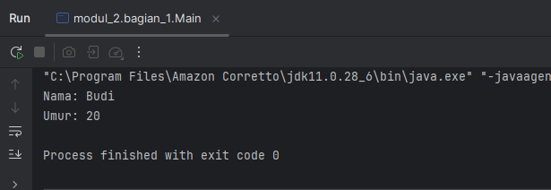
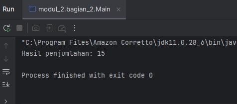
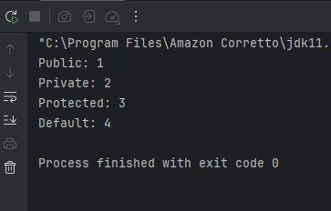
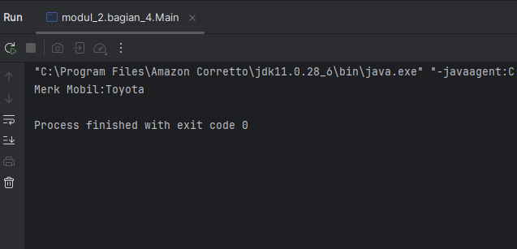
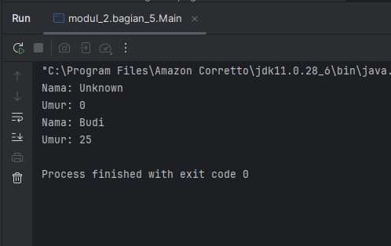

# Laporan Praktikum 2: Review Konsep Dasar OOP Menggunakan Java
**Mata Kuliah:** Praktikum Design Pattern  
**Nama:** Nurul Fadila  
**NIM:** 2024573010026  
**Kelas:** TI 2A

---

## 1. Abstrak

Praktikum ini bertujuan untuk memahami konsep dasar pemrograman berorientasi objek (OOP) dalam Java.Mampu membuat dan menggunakan class, object, attribute, dan method. Memahami penggunaan akses modifier (public, private, protected, default). Mampu mengimplementasikan setter dan getter untuk mengakses dan memodifikasi attribute. Memahami dan mengimplementasikan constructor (default, parameterized, dan constructor overloading).

---
## 2. Praktikum
### Praktikum 1 - Class dan Object
#### Dasar Teori
OOP (Object-Oriented Programming) adalah paradigma pemrograman yang menggunakan "objek" untuk merepresentasikan data dan metode yang beroperasi pada data tersebut. Konsep dasar OOP:

1. Class: Blueprint atau template untuk membuat objek.
2. Object: Instance dari class yang memiliki atribut dan metode.

#### Langkah Praktikum
1. Buka project pada praktikum sebelumnya menggunakan intellij IDEA
2. Buat sebuah package baru di dalam folder src dengan cara klik kanan pada folder src kemudian pilih New -> Package. Beri nama modul_2.
3. Buat Sebuah package baru lagi didalam package modul_2 dengan cara klik kanan dan pilih New -> Package. Beri nama bagian_1
4. Kemudian buat sebuah class baru dengan nama Mahasiswa dan isikan kode berikut:

          public class Mahasiswa {
         String nama;
         int umur;
         }
5. Selanjutnya, buat sebuah class baru dengan nama Main dan isikan kode berikut:

            public class Main {
          public static void main (String[] args) {
          Mahasiswa mhs1 = new Mahasiswa();

        mhs1.nama = "Budi";
        mhs1.umur = 20;

        System.out.println("Nama: " + mhs1.nama);
        System.out.println("Umur: " + mhs1.umur);
          }
          }

#### Screenshoot Hasil

#### Analisa dan Pembahasan
Pada bagian pertama dibuat class Mahasiswa yang berisi dua atribut, yaitu nama bertipe String dan umur bertipe int. Kedua atribut ini tidak menggunakan modifier seperti private atau public, sehingga secara default memiliki akses package-private, artinya masih bisa diakses oleh class lain yang berada dalam package yang sama. Class ini berfungsi sebagai representasi sederhana dari sebuah objek mahasiswa yang memiliki data nama dan umur, tanpa disertai method atau perilaku tambahan.

Kemudian pada bagian kedua dibuat class Main yang memiliki method main sebagai titik awal eksekusi program. Di dalam method ini dilakukan pembuatan objek dari class Mahasiswa dengan perintah Mahasiswa mhs1 = new Mahasiswa();. Proses ini disebut instansiasi, yaitu membuat objek nyata dari sebuah class. Setelah objek berhasil dibuat, atribut nama dan umur diisi langsung menggunakan operator titik, yaitu mhs1.nama = "Budi"; dan mhs1.umur = 20;. Hal ini dimungkinkan karena atribut pada class Mahasiswa tidak bersifat private.

Selanjutnya program menampilkan nilai dari atribut tersebut ke layar menggunakan System.out.println. Output yang dihasilkan adalah nama dan umur yang telah dimasukkan sebelumnya, sehingga membuktikan bahwa objek mhs1 berhasil menyimpan dan menampilkan data.

### Praktikum 2 - Attribute dan Method
#### Dasar Teori
Attribute adalah variabel yang terdapat di dalam sebuah class yang digunakan untuk menyimpan data atau informasi dari objek. Attribute menggambarkan ciri atau sifat dari suatu objek. Misalnya pada class Mahasiswa, attribute bisa berupa nama dan umur. Nilai dari attribute ini bisa berbeda untuk setiap objek, sehingga setiap objek memiliki karakteristik masing-masing.

Sedangkan method adalah fungsi atau prosedur yang terdapat di dalam class yang digunakan untuk melakukan suatu aksi atau operasi terhadap data (attribute). Method menggambarkan perilaku dari suatu objek. Contohnya seperti method untuk menampilkan data, menghitung nilai, atau mengubah isi attribute.

#### Langkah Praktikum
1. Buat Sebuah package baru lagi didalam package modul_2 dengan cara klik kanan dan pilih New -> Package. Beri nama bagian_2
2. Kemudian buat sebuah class baru dengan nama Kalkulator dan isikan kode berikut:

    public class Kalkulator {
    int angka1;
    int angka2;

    int tambah() {
        return angka1 + angka2;
    }
    }

3. Kemudian buat sebuah class baru dengan nama Main dan isikan kode berikut:

         public class Main {
        public static void main (String[] args) {
        Kalkulator kalkulator = new Kalkulator();
        kalkulator.angka1 = 5;
        kalkulator.angka2 = 10;

        System.out.println("Hasil penjumlahan: " + kalkulator.tambah());
        }
        }
4. Jalankan program untuk melihat hasilnya.

#### Screenshoot Hasil

#### Analisa dan Pembahasan
Pada bagian pertama, dibuat sebuah class bernama Kalkulator. Di dalam class ini terdapat dua attribute yaitu angka1 dan angka2 yang bertipe data integer. Attribute ini berfungsi untuk menyimpan nilai yang akan digunakan dalam proses perhitungan. Selain itu, terdapat sebuah method bernama tambah() yang digunakan untuk melakukan operasi penjumlahan antara angka1 dan angka2. Method ini mengembalikan hasil penjumlahan dalam bentuk nilai integer menggunakan perintah return angka1 + angka2;.

Selanjutnya, pada class Main, terdapat method main yang merupakan titik awal eksekusi program. Di dalam method ini dilakukan pembuatan objek dari class Kalkulator dengan perintah Kalkulator kalkulator = new Kalkulator();. Objek ini kemudian digunakan untuk mengakses attribute dan method yang ada di dalam class Kalkulator.

Nilai dari attribute angka1 dan angka2 diisi secara langsung melalui objek, yaitu kalkulator.angka1 = 5; dan kalkulator.angka2 = 10;. Setelah itu, method tambah() dipanggil untuk menghitung hasil penjumlahan dari kedua nilai tersebut. Hasilnya kemudian ditampilkan ke layar menggunakan System.out.println.

Secara keseluruhan, alur kerja program adalah menerima nilai melalui attribute, memprosesnya menggunakan method, dan menampilkan hasilnya sebagai output. Program ini menunjukkan bagaimana data (attribute) dan perilaku (method) bekerja bersama dalam sebuah class.

### Praktikum 3 - Akses Modifier
#### Dasar Teori 
Dalam pemrograman berorientasi objek (Object Oriented Programming/OOP), access modifier digunakan untuk mengatur tingkat akses suatu attribute, method, maupun class. Dengan adanya access modifier, programmer dapat menentukan bagian mana dari program yang boleh diakses oleh class lain dan mana yang harus dilindungi.

Access modifier berperan penting dalam menjaga keamanan data serta mendukung konsep encapsulation, yaitu membungkus data agar tidak dapat diakses secara sembarangan dari luar class.

Dalam bahasa Java, terdapat beberapa jenis access modifier, yaitu public, private, protected, dan default (tanpa modifier).
Jenis akses modifier:
public : Dapat diakses dari mana saja.
private : Hanya dapat diakses dalam class yang sama.
protected : Dapat diakses dalam package yang sama dan subclass.
default : Hanya dapat diakses dalam package yang sama.

#### Langkah Praktikum Inheritance (Pewarisan)
1. Buat Sebuah package baru lagi didalam package modul_2 dengan cara klik kanan dan pilih New -> Package. Beri nama bagian_3
2. Kemudian buat sebuah class baru dengan nama AksesModifier dan isikan kode berikut:

          public class AksesModifier {
         public int publicVar = 1;
         private int privateVar = 2;
         protected int protectedVar = 3;
         int defaultVar = 4;

          public void tampilkan () {
         System.out.println("Public: " + publicVar);
         System.out.println("Private: " + privateVar);
         System.out.println("Protected: " + protectedVar);
         System.out.println("Default: " + defaultVar);

         }

         }

4. Kemudian buat sebuah class baru dengan nama Main dan isikan kode berikut:

         public class Main {
        public static void main(String[] args) {
        AksesModifier contoh = new AksesModifier();
        contoh.tampilkan();
        }
            }

#### Screenshoot Hasil

#### Analisa dan Pembahasan
Pada class AksesModifier, terdapat empat attribute yang masing-masing menggunakan jenis access modifier yang berbeda, yaitu publicVar, privateVar, protectedVar, dan defaultVar. Attribute publicVar menggunakan modifier public, sehingga dapat diakses dari mana saja, baik dari dalam class yang sama maupun dari class lain. Attribute privateVar menggunakan modifier private, sehingga hanya dapat diakses di dalam class AksesModifier itu sendiri. Attribute protectedVar menggunakan modifier protected, yang berarti dapat diakses dalam class yang sama, dalam package yang sama, serta oleh class turunan. Sedangkan defaultVar tidak menggunakan modifier, sehingga secara otomatis memiliki akses default (package-private), yaitu hanya dapat diakses oleh class dalam package yang sama.

Selain attribute, class AksesModifier juga memiliki sebuah method bernama tampilkan(). Method ini bersifat public dan berfungsi untuk menampilkan nilai dari seluruh attribute ke layar menggunakan System.out.println. Karena method ini berada di dalam class yang sama, maka method tersebut dapat mengakses semua attribute, termasuk yang bersifat private.

Pada class Main, terdapat method main sebagai titik awal eksekusi program. Di dalam method ini dibuat sebuah objek dari class AksesModifier dengan nama contoh. Selanjutnya, method tampilkan() dipanggil melalui objek tersebut. Pemanggilan ini berhasil karena method tampilkan() bersifat public.

Ketika program dijalankan, output yang dihasilkan adalah nilai dari semua attribute, yaitu public, private, protected, dan default. Hal ini dapat terjadi karena akses terhadap attribute dilakukan melalui method yang berada di dalam class yang sama, sehingga tidak melanggar aturan access modifier.

### Praktikum 4 - Setter dan Getter

Dalam pemrograman berorientasi objek (Object Oriented Programming/OOP), setter dan getter adalah method yang digunakan untuk mengakses dan mengubah nilai dari attribute yang bersifat private dalam suatu class. Penggunaan setter dan getter merupakan bagian dari konsep encapsulation, yaitu membungkus data agar tidak dapat diakses secara langsung dari luar class.

Getter adalah method yang digunakan untuk mengambil atau membaca nilai dari suatu attribute. Method ini biasanya memiliki tipe data yang sama dengan attribute yang diambil dan mengembalikan nilai tersebut menggunakan perintah return. Dengan adanya getter, data tetap bisa dibaca dari luar class tanpa harus membuka akses langsung ke attribute.

Sedangkan setter adalah method yang digunakan untuk mengubah atau memberikan nilai baru pada suatu attribute. Method ini biasanya memiliki parameter sesuai dengan tipe data attribute yang akan diubah. Dengan setter, programmer dapat mengontrol bagaimana data diubah, misalnya dengan menambahkan validasi agar nilai yang dimasukkan sesuai dengan aturan tertentu.

#### Langkah Praktikum
1. Buat Sebuah package baru lagi didalam package modul_2 dengan cara klik kanan dan pilih New -> Package. Beri nama bagian_4
2. Kemudian buat sebuah class baru dengan nama Mobil dan isikan kode berikut:

         public class Mobil {
         private String merk;

         public void setMerk(String merk) {
        this.merk = merk;
         }

         public String getMerk() {
        return merk;
         }
         }

3. Kemudian buat sebuah class baru dengan nama Main dan isikan kode berikut:

       public class Main {
         public static void main(String[] args) {
         Mobil mobil = new Mobil();
         mobil.setMerk("Toyota");

        System.out.println("Merk Mobil:" + mobil.getMerk());
         }
         }

4. Jalankan program untuk melihat hasilnya.

#### Screenshoot Hasil

#### Analisa dan Pembahasan
Pada class Mobil, terdapat sebuah attribute bernama merk yang bertipe data String dan bersifat private. Penggunaan modifier private bertujuan untuk membatasi akses langsung terhadap attribute tersebut dari luar class, sehingga data lebih aman dan terkontrol.

Untuk mengakses dan mengubah nilai attribute merk, disediakan dua method yaitu setMerk() dan getMerk(). Method setMerk() berfungsi sebagai setter, yaitu untuk memberikan atau mengubah nilai attribute merk. Di dalam method ini digunakan kata kunci this untuk membedakan antara parameter dan attribute milik class. Sedangkan method getMerk() berfungsi sebagai getter, yaitu untuk mengambil atau mengembalikan nilai dari attribute merk.

Pada class Main, terdapat method main sebagai titik awal eksekusi program. Di dalam method ini dibuat sebuah objek dari class Mobil dengan nama mobil. Selanjutnya, nilai attribute merk diisi menggunakan method setter, yaitu mobil.setMerk("Toyota"). Setelah itu, nilai dari attribute tersebut ditampilkan ke layar menggunakan method getter melalui perintah mobil.getMerk().

Ketika program dijalankan, output yang dihasilkan adalah:
Merk Mobil: Toyota

### Praktikum 5 - Constructor
#### Dasar Teori 
Dalam pemrograman berorientasi objek (Object Oriented Programming/OOP), constructor adalah method khusus yang digunakan untuk menginisialisasi objek saat pertama kali dibuat. Constructor akan otomatis dipanggil ketika sebuah objek dibuat menggunakan kata kunci new.

Constructor memiliki nama yang sama dengan nama class dan tidak memiliki tipe data (bahkan tidak menggunakan void). Tujuan utama dari constructor adalah untuk memberikan nilai awal pada attribute suatu objek agar objek tersebut langsung siap digunakan.

Terdapat beberapa jenis constructor, yaitu default constructor dan parameterized constructor. Default constructor adalah constructor tanpa parameter yang biasanya digunakan untuk memberikan nilai awal secara umum. Sedangkan parameterized constructor adalah constructor yang memiliki parameter, sehingga nilai attribute dapat diisi langsung saat objek dibuat.

#### Langkah Praktikum
1. Buat Sebuah package baru lagi didalam package modul_2 dengan cara klik kanan dan pilih New -> Package. Beri nama bagian_5
2. Kemudian buat sebuah class baru dengan nama Person dan isikan kode berikut:

         public class Person {
         private String nama;
         private int umur;

          // Default Constructor
         public Person() {
        nama = "Unknown";
        umur = 0;
          }

         // Parameterized Constructor
         public Person(String nama, int umur) {
        this.nama = nama;
        this.umur = umur;
         }

         // Method
         public void tampilkanInfo() {
        System.out.println("Nama: " + nama);
        System.out.println("Umur: " + umur);
         }

         }

3. Kemudian buat sebuah class baru di dalam abtrak dengan nama Main dan isikan kode berikut:

         public class Main {
          public static void main (String[] args) {
          Person person1 = new Person();
          Person person2 = new Person("Budi", 25);

        person1.tampilkanInfo();
        person2.tampilkanInfo();

    }
            }

         

4. Jalankan program untuk melihat hasilnya.

#### Screenshoot Hasil

#### Analisa dan Pembahasan
Pada class Person, terdapat dua attribute yaitu nama bertipe String dan umur bertipe int yang bersifat private. Penggunaan modifier private bertujuan untuk melindungi data agar tidak dapat diakses langsung dari luar class, sehingga sesuai dengan konsep encapsulation.

Class Person memiliki dua constructor, yaitu default constructor dan parameterized constructor. Default constructor adalah constructor tanpa parameter yang digunakan untuk memberikan nilai awal secara umum, yaitu nama diisi dengan "Unknown" dan umur diisi dengan 0. Constructor ini akan dipanggil ketika objek dibuat tanpa memberikan parameter.

Sedangkan parameterized constructor adalah constructor yang memiliki parameter, yaitu nama dan umur. Constructor ini memungkinkan pengguna untuk langsung mengisi nilai attribute saat objek dibuat. Penggunaan kata kunci this berfungsi untuk membedakan antara parameter dan attribute dalam class.

Selain itu, class Person juga memiliki method tampilkanInfo() yang digunakan untuk menampilkan nilai attribute nama dan umur ke layar.

Pada class Main, terdapat method main sebagai titik awal program. Di dalam method ini dibuat dua objek dari class Person, yaitu person1 dan person2. Objek person1 dibuat menggunakan default constructor sehingga nilainya otomatis menjadi "Unknown" dan 0. Sedangkan person2 dibuat menggunakan parameterized constructor dengan nilai "Budi" dan 25.

Kemudian, method tampilkanInfo() dipanggil pada kedua objek tersebut. Hasilnya, program akan menampilkan informasi masing-masing objek sesuai dengan nilai yang dimiliki.

### Praktikum 6 - Sistem Manajemen Perpustakaan Sederhana
#### Dasar Teori
Berikut adalah contoh program konsol sederhana yang mengimplementasikan seluruh konsep yang telah dibahas sebelumnya, yaitu class, object, attribute, method, akses modifier, setter-getter, dan constructor. Program ini adalah sistem manajemen perpustakaan sederhana yang memungkinkan pengguna untuk menambahkan buku, menampilkan daftar buku, dan mencari buku berdasarkan judul.

#### Langkah Praktikum
1. Buat Sebuah package baru lagi didalam package modul_2 dengan cara klik kanan dan pilih New -> Package. Beri nama bagian_6
2. Kemudian buat sebuah class baru dengan nama Buku dan isikan kode berikut:

        public class Buku {
         // Atribut (private)
         private String judul;
         private String pengarang;
         private int tahunTerbit;

         // Constructor (default)
         public Buku() {
         this.judul = "Unknown";
         this.pengarang = "Unknown";
         this.tahunTerbit = 0;
          }

         // Constructor (parameterized)
         public Buku(String judul, String pengarang, int tahunTerbit) {
         this.judul = judul;
         this.pengarang = pengarang;
         this.tahunTerbit = tahunTerbit;
         }

         // Setter dan Getter
         public void setJudul(String judul) {
         this.judul = judul;
          }

         public String getJudul() {
         return judul;
         }

         public void setPengarang(String pengarang) {
         this.pengarang = pengarang;
         }

         public String getPengarang() {
         return pengarang;
         }

          public void setTahunTerbit(int tahunTerbit) {
         this.tahunTerbit = tahunTerbit;
         }

         public int getTahunTerbit() {
         return tahunTerbit;
         }

         // Method untuk menampilkan informasi buku
             public void tampilkanInfo() {
         System.out.println("Judul: " + judul);
          System.out.println("Pengarang: " + pengarang);
         System.out.println("Tahun Terbit: " + tahunTerbit);
          }
         }

3. Kemudian buat sebuah class baru dengan nama Perpustakaan dan isikan kode berikut:

         import java.util.ArrayList;
         public class Main {

         public class Perpustakaan {
        // Atribut (private)
        private ArrayList<Buku> daftarBuku;

        // Constructor
        public Perpustakaan() {
            daftarBuku = new ArrayList<>();
        }

        // Method untuk menambahkan buku
        public void tambahBuku(Buku buku) {
            daftarBuku.add(buku);
            System.out.println("Buku berhasil ditambahkan!");
        }

        // Method untuk menampilkan semua buku
        public void tampilkanSemuaBuku() {
            if (daftarBuku.isEmpty()) {
                System.out.println("Tidak ada buku dalam perpustakaan.");
            } else {
                System.out.println("Daftar Buku:");
                for (Buku buku : daftarBuku) {
                    buku.tampilkanInfo();
                }
            }
        }

        // Method untuk mencari buku berdasarkan judul
        public void cariBuku(String judul) {
            boolean ditemukan = false;

            for (Buku buku : daftarBuku) {
                if (buku.getJudul().equalsIgnoreCase(judul)) {
                    System.out.println("Buku ditemukan:");
                    buku.tampilkanInfo();
                    ditemukan = true;
                    break;
                }
            }

            if (!ditemukan) {
                System.out.println("Buku dengan judul \"" + judul + "\" tidak ditemukan.");
            }
        }
         }
       }

4. Kemudian buat sebuah class baru dengan nama Main dan isikan kode berikut:

#### Output Program

#### Analisa dan Pembahasan
Fitur Apliaksi:
- Lihat Daftar Tiket: Menampilkan jenis tiket dan harganya.
- Pesan Tiket: Memungkinkan pengguna memesan tiket dengan memilih jenis dan jumlah.
- Lihat Detail Pesanan: Menampilkan detail pesanan berdasarkan nomor pesanan.
- Batalkan Pesanan: Menghapus pesanan berdasarkan nomor pesanan.
- Hitung Total Harga: Menghitung total harga setelah diskon (jika ada).

Penjelasan Program:
- Encapsulation: Atribut seperti jenis dan harga dienkapsulasi dalam class Tiket.
- Inheritance: TiketReguler dan TiketVIP mewarisi class Tiket.
- Polymorphism: Method hitungDiskon() di-override di subclass.
- Abstraction: Class Tiket adalah abstract class dengan method abstrak hitungDiskon().
- Aplikasi ini siap digunakan dan dapat dikembangkan lebih lanjut dengan menambahkan fitur seperti penyimpanan data ke file atau database.

## 3. Kesimpulan
Dalam praktikum ini, kita telah mempelajari konsep dasar Pemrograman Berorientasi Objek (OOP) menggunakan Java, meliputi:

Class dan Object: Blueprint dan instance untuk membangun program.
Encapsulation: Menyembunyikan detail implementasi dengan access modifier dan getter-setter.
Inheritance: Mewarisi atribut dan metode dari superclass ke subclass.
Polymorphism: Method overriding dan overloading untuk fleksibilitas.
Abstraction: Abstract class dan interface