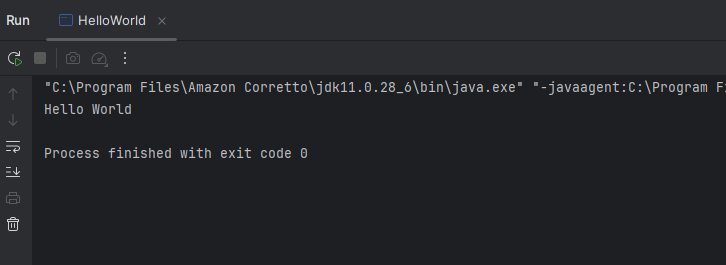
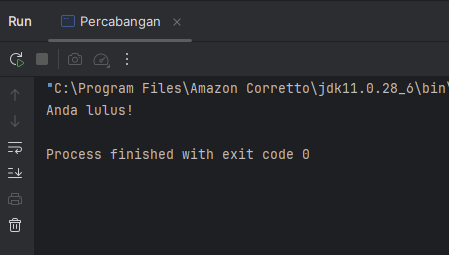
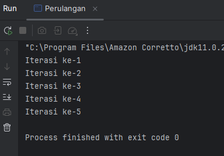

# Laporan Praktikum 1: Review Dasar Pemrograman Java
**Mata Kuliah:** Praktikum Design Pattern  
**Nama:** Nurul Fadila  
**NIM:** 2024573010026  
**Kelas:** TI 2A

---

## 1. Abstrak
Praktikum Dasar Pemrograman Java bertujuan untuk memberikan pemahaman awal mengenai konsep, sintaksis, serta implementasi logika pemrograman menggunakan bahasa Java. Java merupakan bahasa pemrograman berorientasi objek (Object-Oriented Programming) yang memiliki keunggulan berupa portabilitas, kemudahan dalam penggunaan, serta dukungan pustaka yang luas.

Dalam praktikum ini, mahasiswa diperkenalkan pada struktur dasar program Java, penggunaan variabel, tipe data, operator, percabangan, perulangan, serta penerapan array dan fungsi sederhana. Melalui serangkaian percobaan seperti pembuatan program tebak angka, perhitungan faktorial, serta implementasi pola bintang dan tabel perkalian, mahasiswa dilatih untuk mengembangkan logika algoritma dan menuangkannya dalam bentuk kode program yang dapat dijalankan.

Hasil praktikum menunjukkan bahwa pemahaman terhadap struktur kontrol dan alur logika sangat penting dalam membangun program yang efektif dan efisien. Dengan demikian, praktikum ini menjadi dasar yang kuat bagi mahasiswa untuk mempelajari konsep pemrograman yang lebih kompleks pada tahap selanjutnya. 

---
## 2. Praktikum
### Praktikum 1 - Pengenalan Java dan Lingkungan Pengembangan
#### Dasar Teori
Java adalah bahasa pemrograman berorientasi objek yang populer dan banyak digunakan untuk pengembangan aplikasi desktop, web, dan mobile. Java menggunakan sintaks yang mirip dengan C++ tetapi dirancang untuk lebih mudah dipahami dan digunakan.

Untuk memulai pemrograman Java, Anda perlu:

JDK (Java Development Kit): Berisi compiler dan tools untuk mengembangkan program Java.
IDE (Integrated Development Environment): Seperti IntelliJ IDEA, Eclipse, atau NetBeans untuk menulis dan menjalankan kode.
#### Langkah Praktikum
1. Pastikan JDK dan Intellij IDE Community Edition sudah terinstal. Jika belum, kunjungi url berikut untuk mengunduh JDK Amazon Correto dan Intellij
2. Buka IDE dan buat sebuah project baru dengan ketentuan seperti berikut:
   Name: ti_design_pattern
   Location: disesuaikan
   Build system: Intellij
   JDK: Amazon Correto
   Hilangkan centang pada bagian add sample code
3. Buat sebuah package baru di dalam folder src dengan cara klik kanan pada folder src kemudian pilih New -> Package. Beri nama modul_1.
4. Buat Sebuah class didalam package modul_1 dengan cara klik kanan dan pilih New -> Java Class. Beri nama HelloWorld
5. Isikan kode dibawah ini.
   
         public class HelloWorld {
          public static void main (String[] args) {
         System.out.println("Hello World");
         }
         }
6. Output:
    

   
#### Analisa dan Pembahasan
Analisa:

Program Java di atas merupakan program sederhana yang digunakan untuk menampilkan tulisan “Hello World” pada layar. Program ini biasanya digunakan sebagai contoh dasar untuk memahami struktur penulisan program pada bahasa pemrograman Java.

Pada baris public class HelloWorld, program mendeklarasikan sebuah class dengan nama HelloWorld. Kata kunci public menunjukkan bahwa class tersebut dapat diakses oleh class lain. Dalam bahasa Java, setiap program harus berada di dalam sebuah class, dan biasanya nama file program harus sama dengan nama class yang dibuat.

Selanjutnya pada bagian public static void main(String[] args) merupakan method utama (main method) yang menjadi titik awal ketika program dijalankan. Kata public menunjukkan bahwa method dapat diakses secara umum, static berarti method dapat dijalankan tanpa membuat objek terlebih dahulu, void menunjukkan bahwa method tidak mengembalikan nilai, dan String[] args digunakan untuk menerima argumen dari command line.

Pada baris System.out.println("Hello World"); digunakan untuk menampilkan teks ke layar atau console. System.out merupakan objek yang digunakan untuk menampilkan output, sedangkan println adalah method yang berfungsi untuk mencetak teks dan memindahkan kursor ke baris baru setelah teks ditampilkan. Teks "Hello World" merupakan pesan yang akan muncul ketika program dijalankan.

Dari program tersebut dapat dipahami bahwa struktur dasar program Java terdiri dari class, method main, serta perintah untuk menampilkan output, sehingga program ini sering digunakan sebagai langkah awal dalam mempelajari bahasa pemrograman Java.

### Praktikum 2 - Variabel dan Tipe Data
#### Dasar Teori
Variabel digunakan untuk menyimpan data dalam program. Setiap variabel memiliki tipe data yang menentukan jenis nilai yang dapat disimpan. Tipe data dasar di Java:

int: Bilangan bulat (contoh: 10, -5)
double: Bilangan desimal (contoh: 3.14, -0.5)
boolean: Nilai true atau false
char: Karakter tunggal (contoh: 'A', '1')
String: Teks (contoh: "Hello")
#### Langkah Praktikum
1. Buat sebuah class baru di dalam package modul_1 dan beri nama Variable
   2. Tuliskan kode berikut:

            public class Variable {
             public static void main (String[] args) {
            int umur = 20;
            double tinggi = 1.56;
            boolean isMahasiswa = true;
            char jeniskelamin = 'P';
            String nama = "dila";

           System.out.println("Nama: " + nama);
           System.out.println("Umur: " + umur);
           System.out.println("Mahasiswa: " + isMahasiswa);
           System.out.println("Jenis Kelamin: " + jeniskelamin);
           System.out.println("Tinggi: " + tinggi);

             }
                    }
   3. Jalankan program nya untuk melihat hasil.

#### Screenshoot Hasil

#### Analisa dan Pembahasan
Program Java di atas merupakan program yang digunakan untuk mendeklarasikan beberapa variabel dengan tipe data yang berbeda serta menampilkan nilainya ke layar. Program ini bertujuan untuk memperkenalkan penggunaan tipe data dan variabel dalam bahasa pemrograman Java.

Pada baris public class Variable, program mendeklarasikan sebuah class bernama Variable. Kata kunci public menunjukkan bahwa class tersebut dapat diakses oleh class lain. Dalam bahasa Java, setiap program harus berada di dalam sebuah class.

Selanjutnya pada bagian public static void main(String[] args) merupakan method utama yang menjadi titik awal eksekusi program. Method ini akan dijalankan pertama kali ketika program dieksekusi.

Di dalam method main, terdapat beberapa deklarasi variabel dengan tipe data yang berbeda, yaitu:

int umur = 20; digunakan untuk menyimpan data berupa bilangan bulat, dalam hal ini umur bernilai 20.

double tinggi = 1.56; digunakan untuk menyimpan bilangan desimal, yaitu tinggi badan dengan nilai 1.56.

boolean isMahasiswa = true; digunakan untuk menyimpan nilai logika, yaitu benar (true) atau salah (false). Pada program ini menunjukkan bahwa statusnya adalah mahasiswa.

char jeniskelamin = 'P'; digunakan untuk menyimpan satu karakter, yaitu huruf P yang menunjukkan jenis kelamin.

String nama = "dila"; digunakan untuk menyimpan teks atau kumpulan karakter, yaitu nama "dila".

Selanjutnya beberapa perintah System.out.println() digunakan untuk menampilkan nilai dari setiap variabel ke layar. Tanda + berfungsi untuk menggabungkan teks dengan nilai variabel sehingga informasi yang ditampilkan menjadi lebih jelas.

Kesimpulan

Program ini menunjukkan cara mendeklarasikan variabel dengan berbagai tipe data dalam Java, seperti int, double, boolean, char, dan String, serta cara menampilkan nilai variabel tersebut ke layar menggunakan perintah output. Program ini membantu memahami dasar penggunaan variabel dalam pemrograman Java.

### Praktikum 3 - Operator dan Expressi
#### Dasar Teori
Operator dan ekspresi merupakan konsep dasar dalam bahasa pemrograman yang digunakan untuk melakukan berbagai operasi terhadap data atau variabel. Operator adalah simbol yang digunakan untuk melakukan suatu operasi, seperti perhitungan matematika, perbandingan nilai, maupun operasi logika. Sedangkan ekspresi adalah kombinasi antara operator, variabel, dan nilai (operand) yang menghasilkan suatu nilai baru setelah dievaluasi oleh program.
Operator digunakan untuk melakukan operasi pada variabel dan nilai. Jenis operator:

Aritmatika: +, -, *, /, %
Perbandingan: ==, !=, >, <, >=, <=
Logika: && (AND), || (OR), ! (NOT)
Langkah Praktikum

#### Langkah Praktikum
1. Buat sebuah class baru di dalam package modul_1 dan beri nama Operator
2. Tuliskan kode berikut:

         public class Operator {
         public static void main (String[] args) {
         int a = 10;
         int b = 50;

        System.out.println("a+b =" + (a+b));
        System.out.println("a > b?" + (a > b));
        System.out.println("a == b?" + (a == b));
          }
          }

3. Jalankan program nya untuk melihat hasil.

#### Screenshoot Hasil

#### Analisa dan Pembahasan
Program Java di atas merupakan program sederhana yang digunakan untuk menunjukkan penggunaan operator aritmatika dan operator relasional dalam bahasa pemrograman Java. Program ini juga menampilkan hasil operasi tersebut ke layar menggunakan perintah output.

Pada baris public class Operator, program mendeklarasikan sebuah class bernama Operator. Kata kunci public menunjukkan bahwa class tersebut dapat diakses oleh class lain. Dalam Java, setiap program harus berada di dalam sebuah class.

Selanjutnya pada bagian public static void main(String[] args) merupakan method utama (main method) yang menjadi titik awal eksekusi program. Method ini akan dijalankan pertama kali ketika program dijalankan.

Di dalam method main, terdapat dua buah variabel yang dideklarasikan, yaitu int a = 10; dan int b = 50;. Kedua variabel tersebut menggunakan tipe data integer (int) yang berfungsi untuk menyimpan bilangan bulat. Variabel a memiliki nilai 10 dan variabel b memiliki nilai 50.

Pada baris System.out.println("a+b =" + (a+b));, program menggunakan operator aritmatika penjumlahan (+) untuk menjumlahkan nilai dari variabel a dan b. Hasil dari operasi tersebut kemudian ditampilkan ke layar.

Pada baris System.out.println("a > b?" + (a > b));, program menggunakan operator relasional lebih besar dari (>) untuk membandingkan apakah nilai a lebih besar dari b. Hasil dari perbandingan ini berupa nilai boolean, yaitu true atau false. Karena nilai a (10) lebih kecil dari b (50), maka hasilnya adalah false.

Pada baris System.out.println("a == b?" + (a == b));, program menggunakan operator relasional sama dengan (==) untuk mengecek apakah nilai a sama dengan nilai b. Karena kedua nilai tersebut berbeda, maka hasil yang ditampilkan juga false.

### Praktikum 4 - Percabangan (If-Else dan Switch-Case)
#### Dasar Teori
Percabangan merupakan salah satu konsep dasar dalam pemrograman yang digunakan untuk mengambil keputusan berdasarkan suatu kondisi tertentu. Dengan adanya percabangan, program dapat menjalankan perintah yang berbeda tergantung pada kondisi yang diberikan. Percabangan biasanya menggunakan nilai boolean, yaitu true atau false, untuk menentukan apakah suatu perintah akan dijalankan atau tidak.

Salah satu bentuk percabangan yang sering digunakan dalam bahasa pemrograman Java adalah if-else. Struktur if digunakan untuk mengecek suatu kondisi. Jika kondisi tersebut bernilai true, maka perintah di dalam blok if akan dijalankan. Sebaliknya, jika kondisi bernilai false, maka perintah pada bagian else yang akan dijalankan. Percabangan ini sangat berguna untuk menentukan pilihan dalam program, misalnya menentukan apakah suatu nilai memenuhi syarat tertentu atau tidak.

Selain itu terdapat juga bentuk percabangan lain yaitu switch-case. Struktur switch-case digunakan ketika terdapat banyak pilihan kondisi yang bergantung pada satu variabel. Dalam struktur ini, program akan memeriksa nilai dari suatu variabel, kemudian mencocokkannya dengan beberapa case yang tersedia. Jika nilai tersebut sesuai dengan salah satu case, maka perintah pada case tersebut akan dijalankan. Biasanya di akhir setiap case digunakan perintah break agar program tidak melanjutkan ke case berikutnya.

Penggunaan switch-case umumnya lebih sederhana dan lebih mudah dibaca ketika program memiliki banyak pilihan kondisi dibandingkan menggunakan if-else secara berulang. Namun, switch-case biasanya digunakan untuk membandingkan nilai yang bersifat tetap seperti angka atau karakter.

#### Langkah Praktikum
1. Buat sebuah class baru di dalam package modul_1 dan beri nama Percabangan
2. Tuliskan kode berikut:

         public class Percabangan {
         public static void main (String [] args) {
         int nilai = 85;

        if (nilai >= 75) {
            System.out.println("Anda lulus!");
        } else {
            System.out.println("Anda Tidak Lulus!");
        }
          }
          }
3. Jalankan program nya untuk melihat hasil.
#### Screenshoot Hasil

#### Analisa dan Pembahasan
Pada baris public class Percabangan, program mendeklarasikan sebuah class bernama Percabangan. Dalam bahasa pemrograman Java, setiap program harus berada di dalam sebuah class, dan kata kunci public menunjukkan bahwa class tersebut dapat diakses oleh class lain.

Selanjutnya pada bagian public static void main(String[] args) merupakan method utama (main method) yang menjadi titik awal eksekusi program. Ketika program dijalankan, perintah yang berada di dalam method ini akan dieksekusi terlebih dahulu.

Di dalam method main, terdapat deklarasi variabel int nilai = 85;. Variabel nilai menggunakan tipe data integer (int) yang berfungsi untuk menyimpan bilangan bulat. Pada program ini nilai yang diberikan adalah 85.

Kemudian program menggunakan struktur percabangan if (nilai >= 75). Kondisi ini bertujuan untuk mengecek apakah nilai yang dimasukkan lebih besar atau sama dengan 75. Jika kondisi tersebut bernilai true, maka program akan menjalankan perintah System.out.println("Anda lulus!"); yang berarti pengguna dinyatakan lulus.

Namun jika kondisi tersebut bernilai false, maka program akan menjalankan bagian else, yaitu System.out.println("Anda Tidak Lulus!");. Bagian ini digunakan untuk menampilkan pesan bahwa pengguna tidak lulus.

Karena nilai yang digunakan pada program adalah 85, dan nilai tersebut lebih besar dari 75, maka kondisi pada if bernilai true, sehingga output yang ditampilkan adalah "Anda lulus!".

### Praktikum 5 - Perulangan (For, While, Do-While)
#### Dasar Teori
Perulangan merupakan salah satu konsep dasar dalam pemrograman yang digunakan untuk menjalankan suatu perintah secara berulang-ulang selama kondisi tertentu terpenuhi. Dengan menggunakan perulangan, penulisan kode program menjadi lebih efisien karena tidak perlu menuliskan perintah yang sama secara berulang secara manual. Perulangan biasanya digunakan ketika program perlu melakukan proses yang sama beberapa kali, seperti menampilkan data, melakukan perhitungan berulang, atau memproses sejumlah data.

Dalam bahasa pemrograman Java terdapat beberapa jenis perulangan, salah satunya adalah perulangan for. Perulangan for biasanya digunakan ketika jumlah perulangan sudah diketahui dengan jelas. Struktur dasar perulangan ini terdiri dari tiga bagian utama, yaitu inisialisasi variabel, kondisi perulangan, dan perubahan nilai variabel (increment atau decrement). Selama kondisi yang ditentukan bernilai benar (true), maka perintah yang berada di dalam blok perulangan akan terus dijalankan.

Jenis perulangan lainnya adalah while. Perulangan while akan menjalankan blok kode selama kondisi yang diberikan bernilai true. Pada perulangan ini, kondisi akan diperiksa terlebih dahulu sebelum program menjalankan perintah di dalamnya. Jika kondisi sejak awal bernilai false, maka perulangan tidak akan dijalankan sama sekali.

Selain itu terdapat juga do-while. Perulangan do-while hampir sama dengan perulangan while, tetapi perbedaannya adalah blok kode akan dijalankan terlebih dahulu sebelum kondisi diperiksa. Dengan demikian, perulangan do-while pasti akan dijalankan minimal satu kali meskipun kondisi yang diberikan bernilai false.

#### Langkah Praktikum
1. Buat sebuah class baru di dalam package modul_1 dan beri nama Perulangan
2. Tuliskan kode berikut:

         public class Perulangan {
         public static void main(String[] args) {
         for(int i = 1; i<=5; i++)

          {
         System.out.println("Iterasi ke-" + i);
         }
              }
                 }
3. Jalankan program nya untuk melihat hasil.

#### Screenshoot Hasil

#### Analisa dan Pembahasan
Pada baris public class Perulangan, program mendeklarasikan sebuah class bernama Perulangan. Dalam bahasa pemrograman Java, setiap program harus berada di dalam sebuah class. Kata kunci public menunjukkan bahwa class tersebut dapat diakses oleh class lain.

Selanjutnya pada bagian public static void main(String[] args) merupakan method utama (main method) yang menjadi titik awal eksekusi program. Ketika program dijalankan, perintah yang terdapat di dalam method ini akan dieksekusi terlebih dahulu.

Di dalam method main, digunakan perulangan for(int i = 1; i <= 5; i++). Pada perulangan ini terdapat tiga bagian utama, yaitu inisialisasi, kondisi, dan increment.

Inisialisasi ditunjukkan oleh int i = 1, yang berarti variabel i dimulai dari nilai 1.

Kondisi ditunjukkan oleh i <= 5, yang berarti perulangan akan terus berjalan selama nilai i kurang dari atau sama dengan 5.

Increment ditunjukkan oleh i++, yang berarti nilai i akan bertambah 1 setiap kali perulangan dijalankan.

Di dalam blok perulangan terdapat perintah System.out.println("Iterasi ke-" + i); yang berfungsi untuk menampilkan teks "Iterasi ke-" diikuti dengan nilai variabel i. Karena perulangan berjalan dari nilai 1 sampai 5, maka program akan menampilkan pesan iterasi sebanyak lima kali.

### Praktikum 6 - Practice Problem dan Solusinya
#### Practice Problem
1. Buat program untuk menghitung faktorial dari suatu bilangan.
2. Buat program untuk mengecek apakah suatu bilangan adalah bilangan prima.
3. Buat program untuk mencetak pola segitiga menggunakan *.

#### Solusi
1. Buat sebuah class baru di dalam package modul_1 dan beri nama Factorial dan isikan kode berikut. Kemudian jalankan untuk melihat hasilnya.
   
        public class Factorial {
        public static void main (String [] args) {
         int n = 5;
         int hasil = 1;
        for (int i = 1; i <= n; i++) {
        hasil *= i;
        }
        System.out.println("Faktorial dari " + n + " adalah " + hasil);
        }
         }

2. Buat sebuah class baru di dalam package modul_1 dan beri nama Prima dan isikan kode berikut. Kemudian jalankan untuk melihat hasilnya.

        public class Prima {
         public static void main (String[] args) {
         int n = 7;
          boolean isPrima = true;

        for (int i = 2; i <= n / 2; i++) {
            if (n % i == 0) {
                isPrima = false;
                break;
            }
        }

        System.out.println(n + (isPrima ? " adalah bilangan prima." : " bukan bilangan prima."));

         }
         }
3. Buat sebuah class baru di dalam package modul_1 dan beri nama Segitiga dan isikan kode berikut. Kemudian jalankan untuk melihat hasilnya.

         public class Segitiga {
         public static void main(String[] args) {
         int tinggi = 5;

        for (int i = 1; i <= tinggi; i++) {
            for (int j = 1; j <= i; j++) {
                System.out.print("* ");
            }
            System.out.println();
        }
         }
         }

#### Screenshoot Hasil

#### Analisa dan Pembahasan